# NBUSAI 教师工作台（Vue 3 + Flask）

面向高校教师的科研 / 教学 / 学生指导一体化工作台。前端 **Vue 3**（免构建、离线可用），后端 **Flask + SQLite**，一套代码覆盖 **14 个业务页面 + 12 个内置工具**，薄荷绿主题与桌面版保持一致；内置 **LangChain / LangGraph 智能助手**（可查询登记工作台数据、基于个人知识库回答专业问题），并可将个人学术简历以**固定链接公开发布**（内容随工作台数据实时更新）。

系统内置**账号体系与双角色**：教师登录后使用完整工作台；管理员进入**管理中心**，可查看所有教师的简要信息与四类统计（科研成果 / 学术交流 / 教学情况 / 学生指导），对教师登记的科研成果执行**审核（通过 / 退回 / 撤回、单条与批量）**，并新建、编辑、重置密码、停用或删除教师账号。

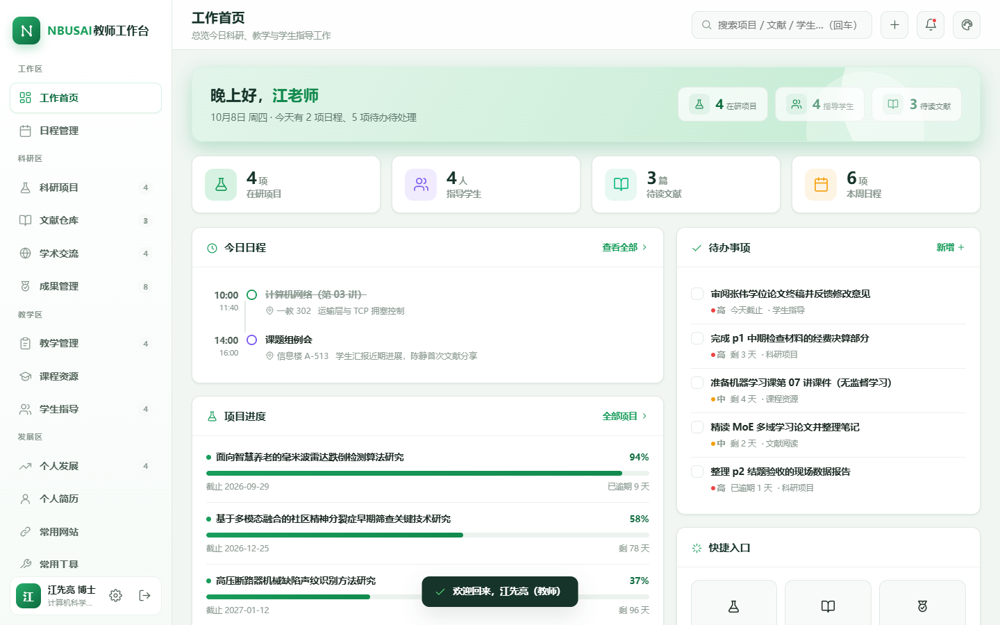

---

## 1. 功能总览

| 分区 | 页面 | 说明 |
| --- | --- | --- |
| 工作区 | 工作首页 | 问候与今日概览、4 张统计卡、今日日程时间线、项目进度、待办勾选、9 个快捷入口 |
| 工作区 | 日程管理 | 月历 + 当日安排双栏，类型筛选，新建/编辑/标记完成，自动统计今日 / 未来 7 天 / 未完成 / 已逾期 |
| 工作区 | 智能助手 | **LangChain / LangGraph 智能体**：多会话对话、工具调用轨迹展示、查询登记日程 / 待办 / 项目 / 课程 / 学生 / 文献，基于**个人知识库**回答专业问题并标注出处 |
| 科研区 | 科研项目 | 项目卡片、阶段任务勾选（自动重算进度）、成果产出、详情页 |
| 科研区 | 文献仓库 | 阅读状态、研究方向、星级、阅读笔记，详情页快捷切换状态 |
| 科研区 | 学术交流 | 会议 / 审稿 / 评审 / 企业交流，状态与级别徽标 |
| 科研区 | 成果管理 | 论文 / 专利 / 软著 / 奖励登记，业绩分自动汇总，卡片展示学院审核状态与审核意见 |
| 教学区 | 教学管理 | 教学任务、大纲进度、任务清单勾选、评教与工作量统计 |
| 教学区 | 课程资源 | 课程卡片（含学生可见徽标）、教学大纲表格、**教学日历**、**课程助教**、QQ 群联系方式与二维码、资料上传 / 下载 / 删除、学生访问设置 |
| 教学区 | 学生指导 | 学生卡片、论文里程碑、沟通记录时间线、行内新增记录 |
| 发展区 | 个人发展 | 职称 / 人才项目 / 培训 / 考核目标，指标进度条与到期提醒 |
| 发展区 | 个人简历 | 对外展示的学术简历：发布卡（公开开关 / 固定链接 / 打印导出）、头像上传、简历基本信息、教育经历与社会服务维护、11 个展示区块开关 |
| 发展区 | 常用网站 | 学术站点导航：分组分节展示、关键词搜索、管理模式拖动排序与增删改 |
| 发展区 | 常用工具 | 12 个内置工具，点击卡片即弹窗运行，含执行留痕 |

**12 个内置工具**：教学日历编排、成绩批量计算、参考文献格式转换、经费预算测算、论文投稿进度追踪、研究生培养进度看板、值班与调课登记、学术会议纪要模板、PDF 批量合并与拆分、科研成果统计导出、课件 PPT 风格统一、实验室设备借用登记。

### 1.1 账号与管理端

- **注册 / 登录**：登录页支持注册教师账号（可选「演示数据初始化」），会话为签名 Cookie，有效期 14 天；密码使用 PBKDF2-SHA256 哈希存储。
- **管理端**：管理员登录后进入「NBUSAI管理中心」，含三个视图：
  - **数据概览**：全校汇总统计卡（在册教师 / 在研与全部项目 / 文献 / 成果 / 教学学时 / 指导学生 / 待审成果 / 学术交流）+ 教师横向对比表（含待审列，点击行进入详情）；
  - **成果审核**：跨全部教师的成果审核队列，按「待审核 → 已退回 → 已通过」排序；支持状态标签页、教师筛选、关键词检索、单条通过 / 退回（必填意见）/ 撤回、勾选批量通过 / 批量退回，并可点开成果查看字段详情与完整审核轨迹；
  - **教师管理**：教师卡片列表（含待审徽标），支持新建账号、编辑资料、重置密码、停用 / 启用、删除；
  - **教师统计详情**：单位教师的科研成果、学术交流、教学情况、学生指导四类统计区块（渐变教师名片 + 4 项核心指标、区块锚点导航、指标卡、环形图 / 条形图 / 仪表环、审核概况与审核轨迹、项目与教学清单、需约谈学生列表）。
- **数据隔离**：每位教师一个独立 SQLite 租户库（`data/tenants/<uid>.db`），物理隔离、教师接口无需 owner 过滤；账号集中存于 `data/users.db`。

### 1.2 成果审核闭环

审核状态**直接写在成果文档上**（不新增中间表），教师提交与管理员审核共用同一份数据：

| 字段 | 含义 |
| --- | --- |
| `auditStatus` | 待审核 / 已通过 / 已退回 |
| `auditNote` | 最近一次审核意见 |
| `auditBy` / `auditAt` | 审核人与审核时间 |
| `auditLog` | 审核轨迹数组（登记 / 通过 / 退回 / 撤回 / 重新提交，最多保留 20 条） |

- **教师侧**：新登记成果自动进入「待审核」并写入一条「登记」轨迹；已出结论的成果一旦改动核心字段（标题 / 类型 / 级别 / 作者 / 日期 / 状态 / 业绩分 / 关联项目 / DOI / 备注），自动回到「待审核」并追加「重新提交」轨迹。成果卡片与列表会显示学院审核状态、退回意见或通过提示。
- **管理员侧**：审核队列跨教师汇总，退回必须填写审核意见（前后端双重校验，≤200 字），单次批量上限 200 条；审核后待审数与业绩分实时回填到概览、导航徽标与教师详情页。
- **存量数据回填**：v2 之前登记的成果没有审核字段，服务启动时由 `audit.ensure_fields()` 统一补齐 —— 已是「已发表 / 已录用 / 已授权 / 已登记 / 已交付 / 已获奖」的视为**已通过**，其余（撰写中 / 审稿中 / 申报中…）进入**待审核**队列。

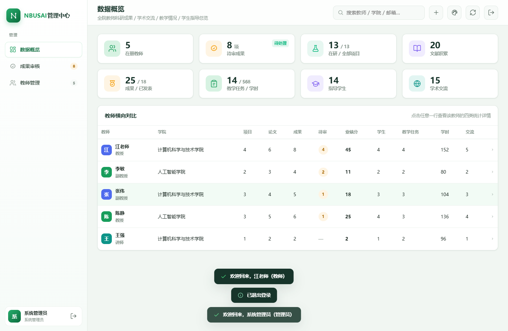

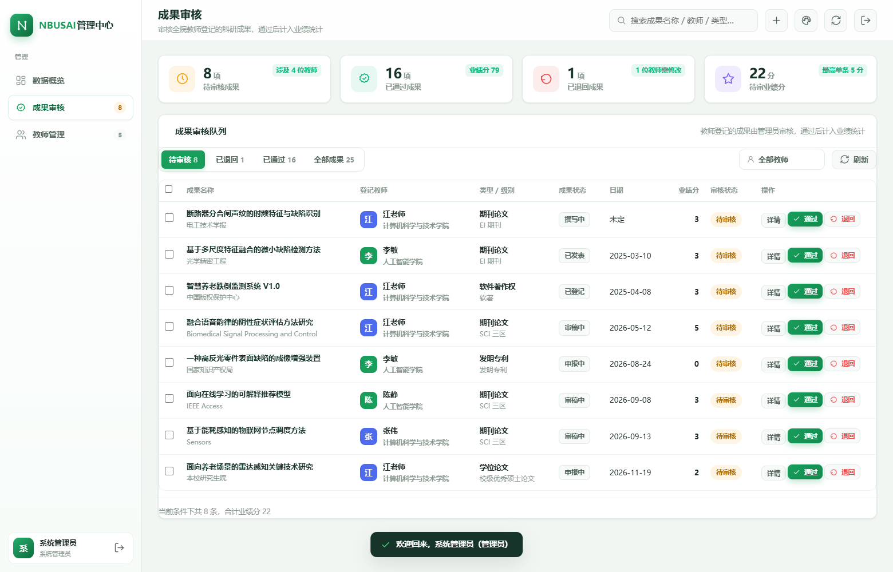

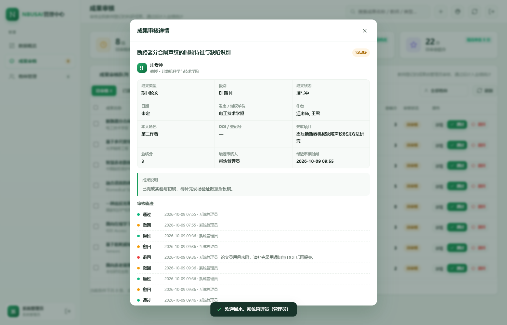

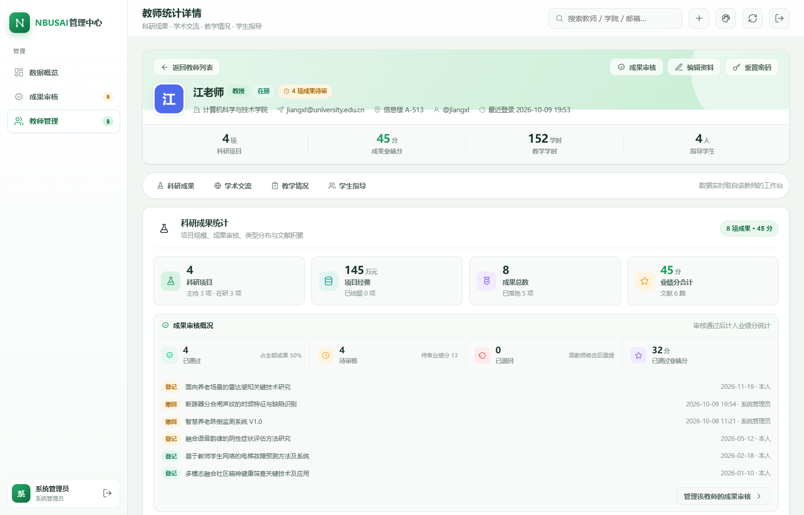

### 1.3 课程开放与学生公开页

课程资料支持**真实文件上传下载**，并可将课程**开放给学生直接访问**（免登录）：

- **课程资料**：课程详情页「课程资料」标签页可多选上传文件（单次 ≤10 个、单个 ≤64 MB），自动记录体积、类型与上传人；每条资料可下载、可删除（服务器文件同步清理）。种子数据里只有登记信息的资料会标为「未上传文件」，不对学生展示。
- **学生访问控制**：课程文档内嵌三个字段 ——
  | 字段 | 含义 |
  | --- | --- |
  | `published` | 是否对学生开放（关闭时学生打开链接只见「暂未开放」） |
  | `openFrom` / `openUntil` | 可选开放时间窗口（按自然日，含首尾；到点自动生效 / 失效） |
  | `shareToken` | 16 位随机访问令牌，学生链接为 `/c/<token>`，与课程 id 解耦防枚举 |
- **学生公开页**：`/c/<token>` 免登录展示课程横幅、任课教师、简介、教学大纲、**教学日历**与可下载资料，侧栏含联系方式卡；不可见时按原因给出「已关闭 / 定时开放 / 已结束 / 链接无效」四种提示，且**不下发任何正文数据**；公开接口剥离 `published / shareToken / students` 等私有字段。
- **教学日历**：按周维护「周次 / 日期 / 教学内容 / 学时 / 形式 / 备注」，公开页以表格展示并**自动高亮本周**；支持从教学大纲**一键生成**（逐章对应教学周，自动推算每周日期），行内容在服务端统一清洗（白名单字段、空行丢弃、周次缺失自动补齐）。
- **联系方式**：QQ 群号（手填）与**群二维码**（图片上传，按内容嗅探类型，≤4 MB）随课程维护，学生公开页可直接**扫码或放大查看**；教师手机号自动取自工作台个人资料，学生可一键拨打。
- **课程助教**：每门课可登记多名助教（姓名 / 身份分工 / 电话 / 邮箱 / QQ / 值班备注），在「课程助教」标签页展示，并通过「助教与联系方式」弹窗增删改；学生公开页侧栏同步展示助教卡，电话与邮箱可一键拨打 / 发信。名单与日历共用同一套服务端清洗（白名单字段、空行丢弃、长度截断、单课 ≤10 人），未开放课程不下发任何助教信息。
- **教师侧入口**：详情页顶部「学生访问」状态条实时显示当前状态、可下载资料数与访问链接（复制 / 预览），「开放设置」弹窗内开关、日期范围、保存后状态**实时预演**；课程列表卡片右上角也有可见性徽标，列表统计含「学生可见」数。
- **安全边界**：公开资料下载与二维码读取均二次校验可见性（关闭课程后直链立即失效）；资料与二维码存储路径强制以 `<uid>/<cid>/` 开头并防 `..` 穿越，教师无法把路径指向他人目录越权下载；删除课程时资料目录一并清理。

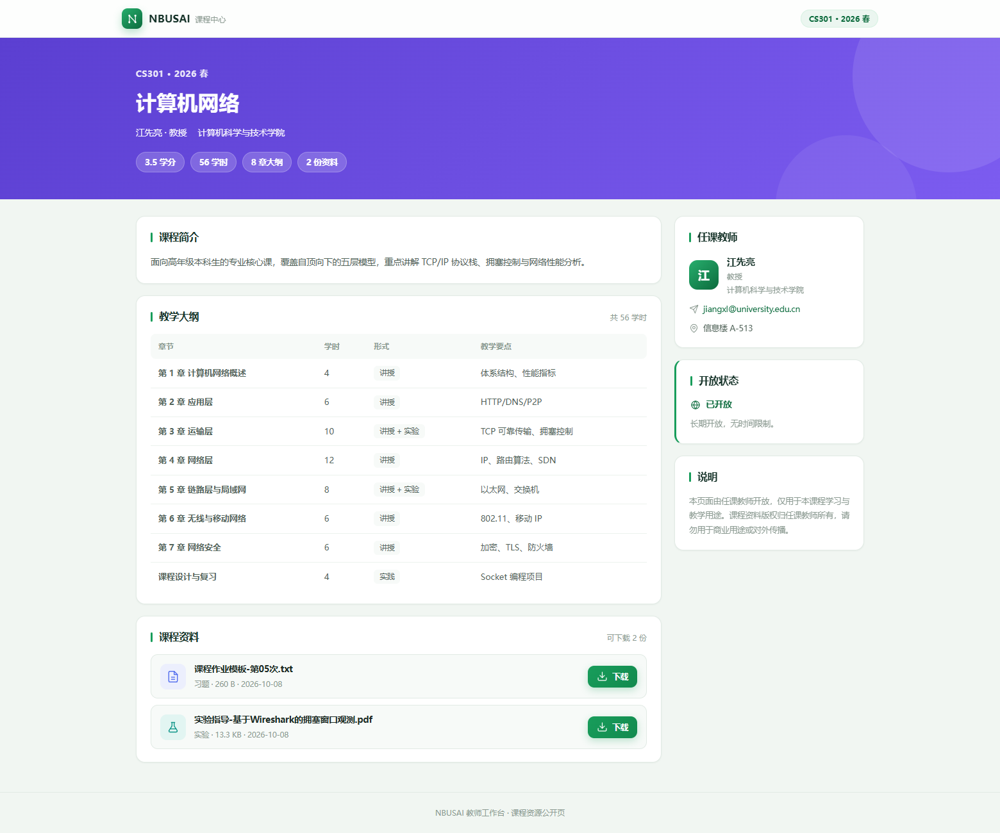

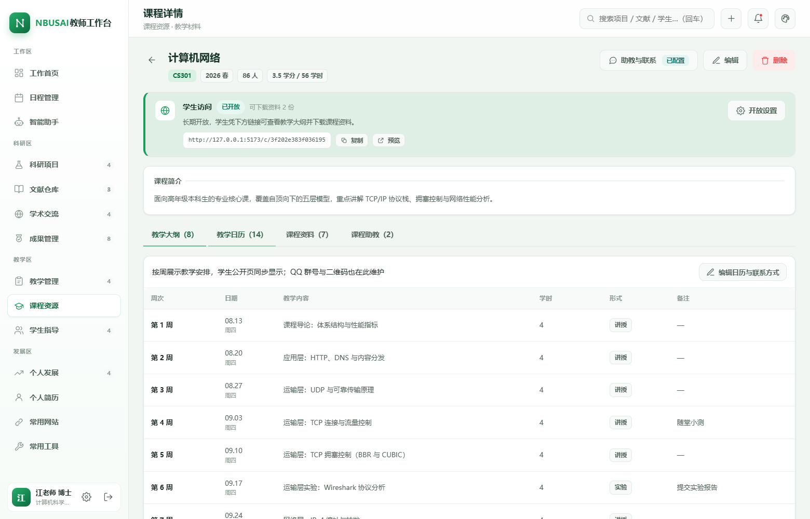

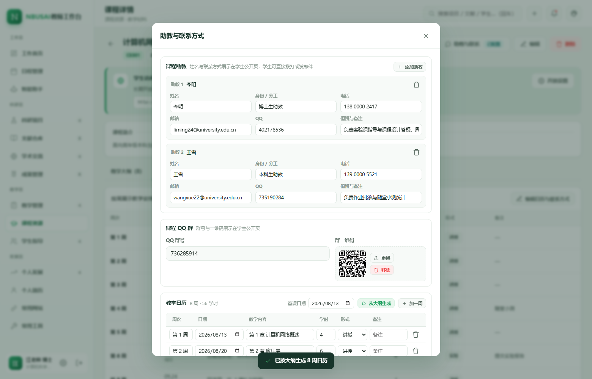

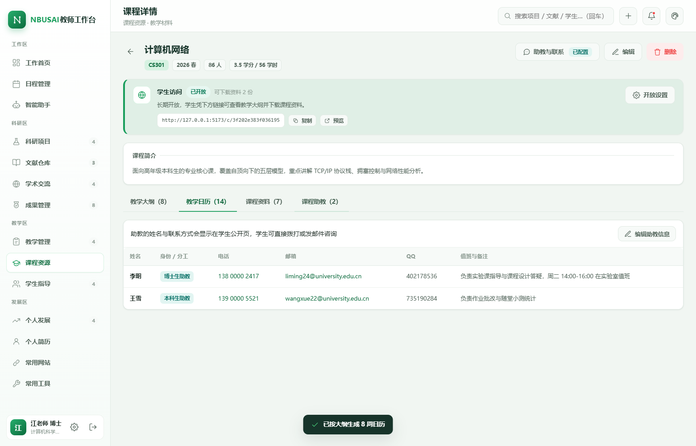

### 1.4 界面配色（5 套主题）

整套界面（含登录页、教师工作台、管理中心）由 CSS 变量驱动，**一键切换 5 套配色**：

| 配色 | 说明 |
| --- | --- |
| 薄荷绿 | 默认配色，与桌面版一致 |
| 橙色 | 温暖醒目，活力感强 |
| 蓝色 | 理性专业，学术蓝调 |
| 橙蓝 | 橙为主色、蓝为辅助，撞色搭配 |
| 灰黑 | 深色界面，夜间护眼 |

- **入口**：顶栏调色板按钮（教师端与管理端都有）→ 弹窗选择；设置面板「界面配色」分区；登录页卡片底部也可直接选（登录前即可预览）。
- **即时生效**：点击色块立即切换并给出提示，选择保存在浏览器 `localStorage`（键 `fwb-theme`），刷新与下次访问自动恢复；此前选择过已移除配色的用户会自动回落到薄荷绿。
- **实现**：`frontend/js/theme.js` 在首屏渲染前应用主题（切换 `<html data-theme>`，无闪烁）；所有颜色均走 CSS 变量，深色主题下文字、徽标、阴影、输入框已全部适配。

### 1.4 登录 / 注册页

- **统一外壳布局**：左侧品牌区（渐变标题、4 张能力卡、特性标签）+ 右侧登录卡片，背景为主题色光晕与细网格，登录前即可切换配色。
- **精致输入框**：所有输入框带前置图标（用户 / 钥匙 / 学院 / 邮箱…），46px 高、12px 圆角，悬停变色、聚焦主题色光圈；密码框内置「显示 / 隐藏」切换。
- **主按钮**：文字居中 + 右侧箭头（悬停右移），渐变底色与主题联动；「注册并进入」同样式。
- **演示账号**：点击自动填充；登录 / 注册 Tab 切换会清空错误提示与密码可见状态。

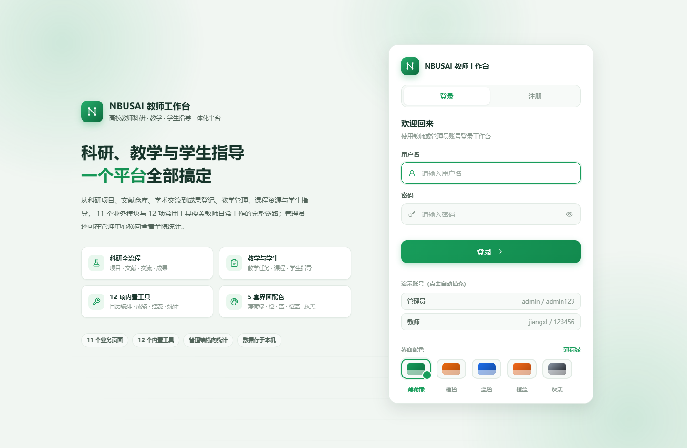

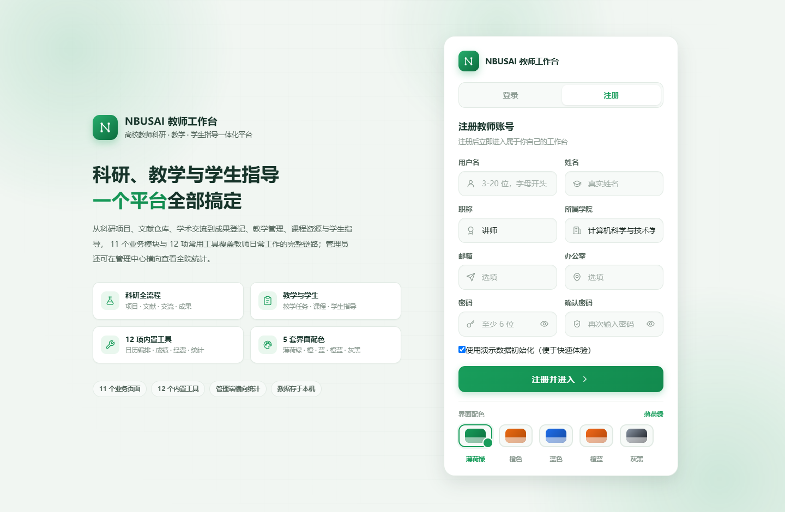

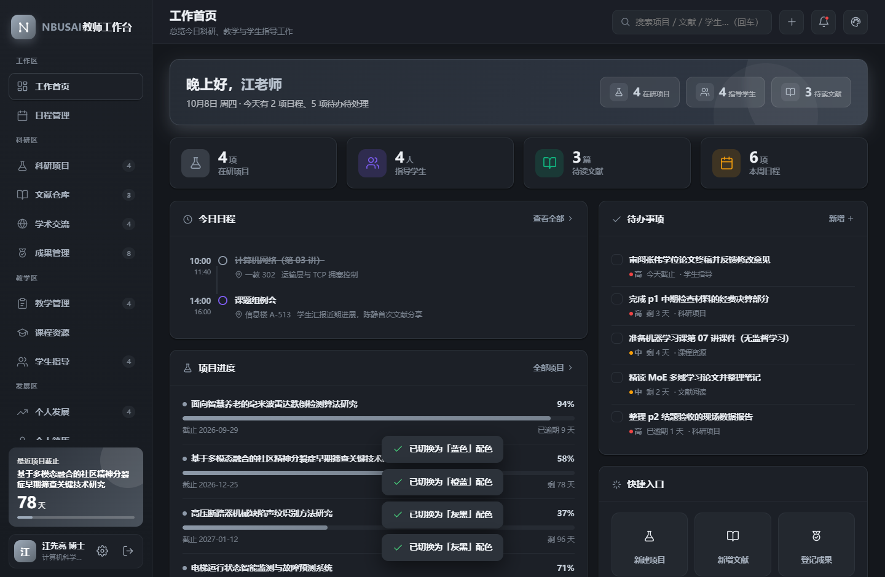

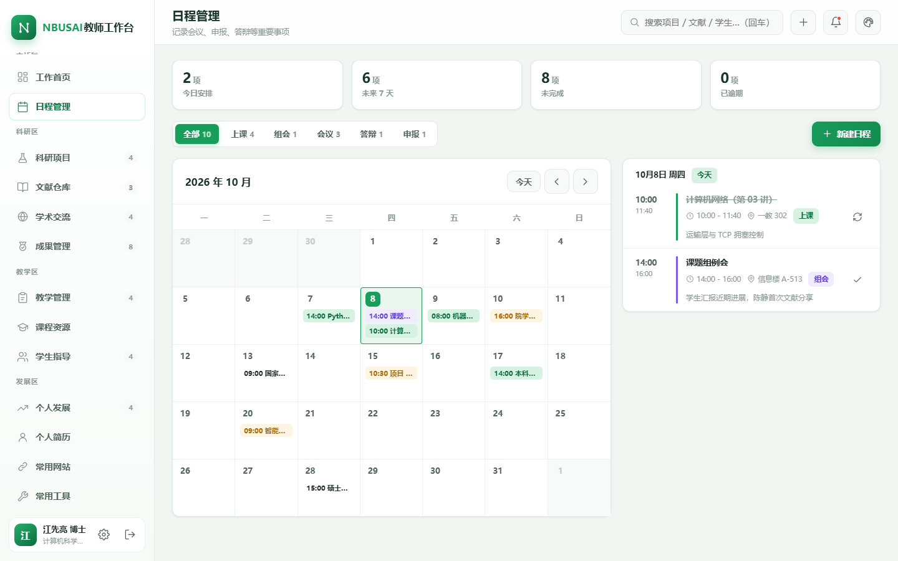

### 1.5 常用网站（独立页面）

「常用网站」是发展区的**独立页面**（工作首页只保留概览与快捷入口），集中维护一键直达的学术与教学站点：

- **分组分节展示**：默认按「学术资源 / 教学平台 / 科研工具 / 公共服务…」分组分节，每节标题带数量角标，像一份个人网站导航；页面顶部统计卡显示网站总数 / 分组数 / 当前展示数。
- **关键词搜索**：按名称、备注、域名模糊过滤，与分组筛选可叠加，一键清空。
- **小卡片 + 自动图标**：每张卡片展示站点图标、名称与备注（无备注时回退主机名），悬停显示备注与完整网址；图标由**服务端自动抓取**（先试 `/favicon.ico`，再解析页面 `<link rel="icon">`，含 data:URI 与中文域名），抓取结果缓存 30 天，失败 6 小时内不重试。
- **永不出现裂图**：站点抓不到图标时，服务端现场生成**首字母头像**（同站同色的 SVG 渐变块）返回，前端 `` 始终有内容，控制台不会有资源报错；图标加载成功后渐显替换。
- **增删改 + 分组**：「管理网站」进入编辑模式 —— 每张卡片浮出编辑 / 删除按钮，末尾出现虚线「添加网站」卡片；「添加 / 编辑」弹窗支持名称、网址、分组与备注，**输入网址后自动探测站点标题回填名称**，并实时预览图标与给出抓取状态。
- **拖动排序**：编辑模式下拖动卡片即调整顺序，排序始终基于「全部」的完整顺序落库（筛选态下拖动也不会打乱其他分组），刷新后保持。
- **安全边界**：仅接受公网 http/https 站点（拒绝内网 / 环回 / 链路本地地址，防 SSRF 探测）；按 magic bytes 嗅探图片类型，不会把站点错误页缓存成图标；抓取并发有闸门，不会占满 WSGI 线程池。
- **存量兼容**：功能上线前就存在的教师库会在启动时补一份出厂清单（`meta` 标记位保证只补一次，教师清空后不会被复活）。

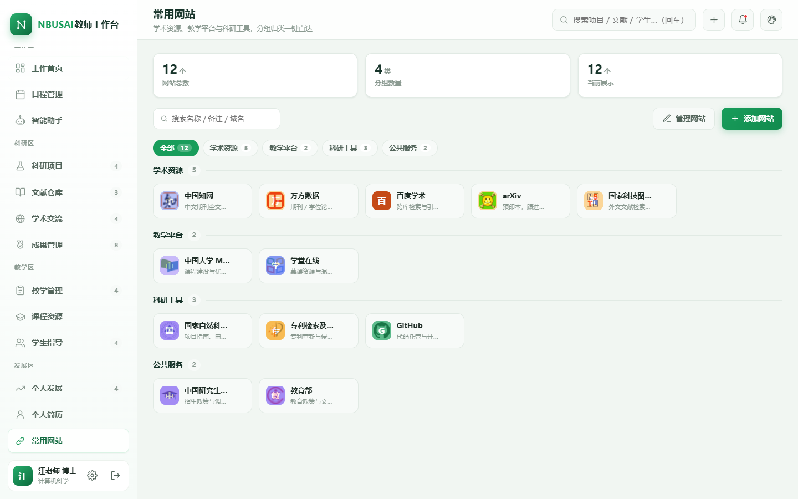

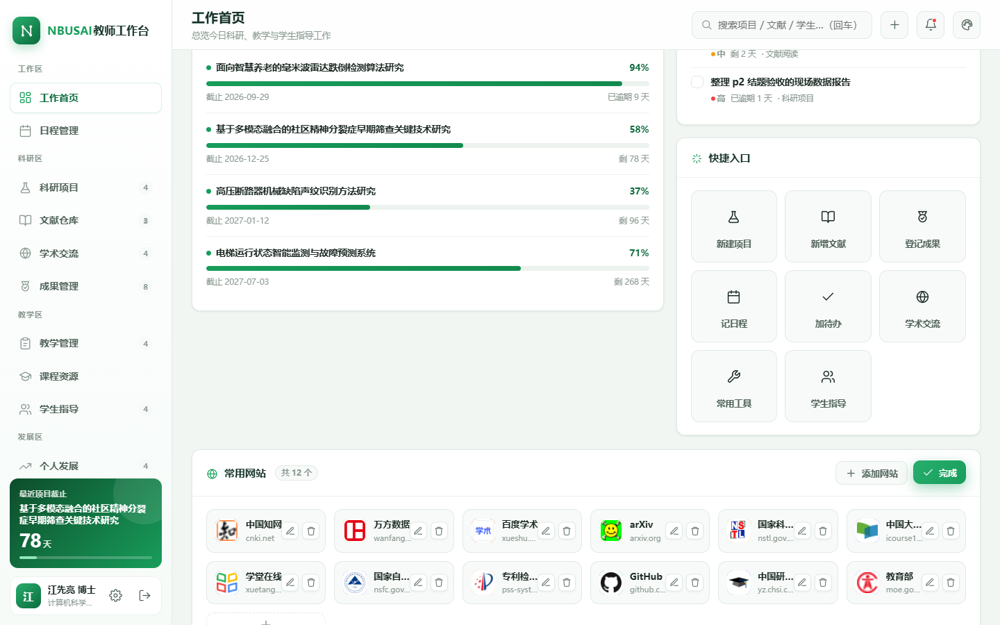

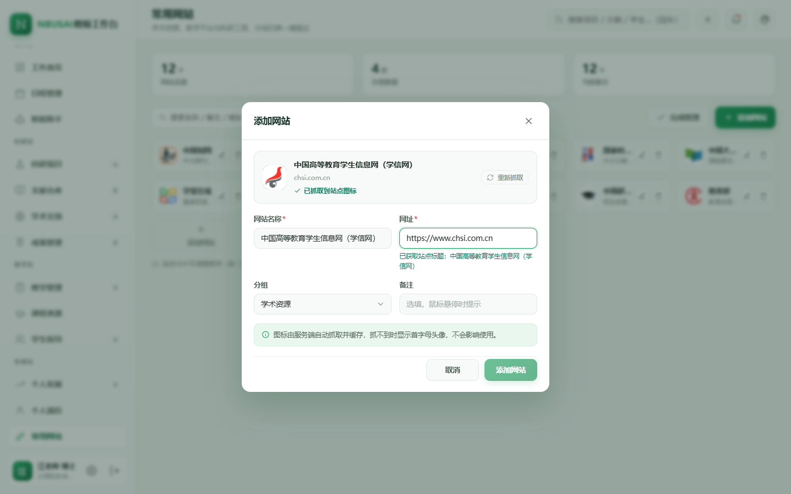

### 1.6 个人简历公开页（固定链接）

工作台里的数据可以一键变成一份**对外公开的学术简历**，访客凭固定链接免登录访问：

- **发布卡**：公开开关（关闭后访客只见「暂未公开」提示）、固定链接展示与复制、新窗口打开、**打印 / 导出 PDF**（公开页自动唤起打印，版式与访客一致）、更换链接（确认后旧链接立即失效）。
- **固定链接**：`/cv/<token>`，token 为 16 位随机串、与账号 id 解耦防枚举，生成后长期不变；跨教师查找令牌时不暴露教师 id。
- **内容实时同步，不存副本**：项目 / 成果 / 学生 / 教学从各自页面自动汇总，教育经历、社会服务、联系方式、研究方向、头像在简历页维护 —— 教师改完，访客刷新即见最新内容。
- **简历区块**：数据概览、个人简介、研究方向、教育经历（时间线）、项目经历（在研优先）、论文发表（按年分组编号）、专利软著、社会服务（按类型分组）、学生指导、教学经历、荣誉奖励，共 **11 个区块可单独开关**；未填内容自动整段隐藏。
- **隐私白名单**：公开数据只含展示字段 —— 业绩分、内部备注、关联项目、审核状态与轨迹、**学生邮箱**、日程 / 待办 / 工具等一律不下发；未公开时接口只返回 403 + 原因，不下发任何正文。
- **头像**：上传后按内容嗅探图片类型（≤4 MB），落盘 `data/avatars/<uid>/` 并自动清理旧文件；路径强制 `<uid>/` 前缀且限制在头像目录内，无法指向他人文件越权访问；未设置时展示姓名首字。
- **自适应与深色**：公开页带锚点导航（滚动高亮）、响应式（桌面 / 平板 / 手机无横向溢出）、跟随系统深色模式与打印样式（自动隐藏导航与按钮）。

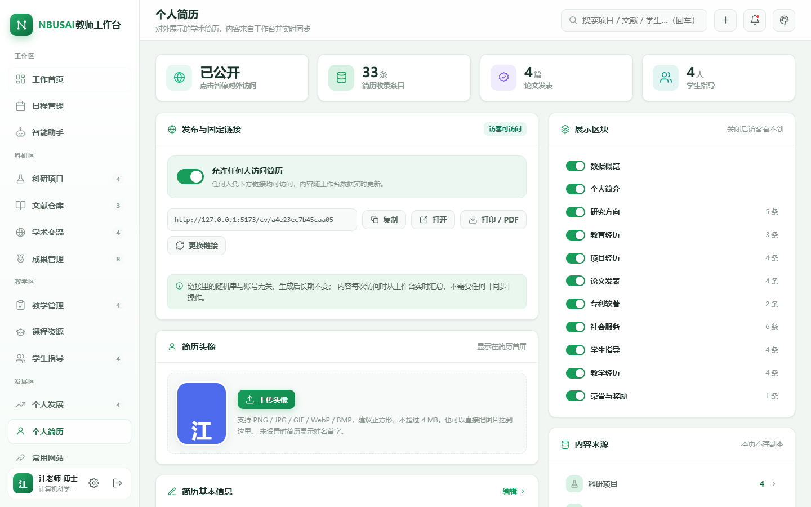

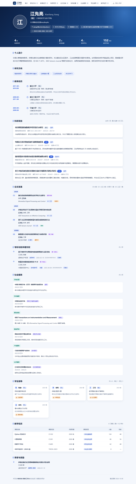

---

### 1.7 智能助手（LangChain / LangGraph + 知识库）

工作区独立页面，底层为 **LangChain 1.x Agent + LangGraph ReAct 执行图**，通过 OpenAI 兼容协议接入大模型：

- **回答排版**：回答按 **Markdown 渲染**（表格 / 列表 / 加粗 / 代码块 / 引用，本地化 marked，离线可用），模型输出的原生 HTML 一律转义显示，杜绝注入；工具调用轨迹折叠在回答下方。
- **管理教师工作台**：智能体可自主调用 11 个工具 —— 查询日程 / 待办 / 项目 / 课程（含大纲与教学日历）/ 学生 / 文献 / 个人资料，**登记日程与待办**（相对时间自动换算为具体日期）；多会话管理，气泡下方折叠展示**工具调用轨迹**（调了什么工具、拿到了什么），过程透明可追溯。
- **知识库（RAG）**：上传 txt / md / pdf / docx（单文件 ≤10 MB），服务端中文分块后建立 **BM25 检索索引**（jieba 分词，本地运行零额外费用）；回答专业问题时先检索知识库、**以「依据：文档名」标注出处**，未命中则如实说明。每教师知识库独立隔离，支持检索试测（先看会命中什么再问）。
- **模型可配置**：设置页内置 DeepSeek / 通义千问 / Kimi / 本地 Ollama / 自定义（任意 OpenAI 兼容服务）五种预设，切换供应商自动填充地址与模型；API Key 只存租户库且**只回显掩码**；支持一键连通性测试；未配置 Key 时对话被拦截并引导到设置页。
- **多租户安全**：会话、消息、知识库、模型配置全部存各教师租户库；工具闭包持有当前登录教师的 Store，跨租户数据不可达。

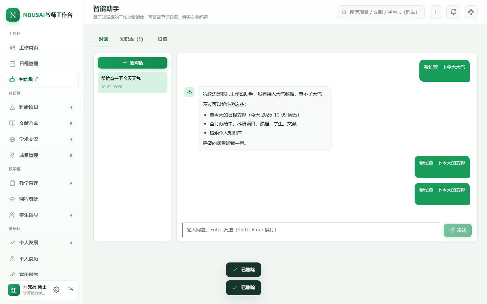

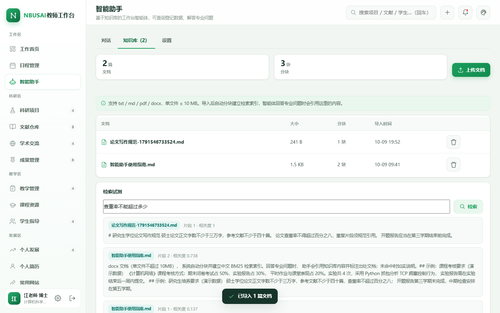

---

## 2. 技术栈与架构

```
vue-flask-buddy/
├── run.py                  # 统一启动入口（开发 / 生产）
├── requirements.txt        # Python 依赖
├── start.bat / start.sh    # Windows / macOS·Linux 一键启动
├── backend/                # Flask 后端
│   ├── __init__.py         # 应用工厂 create_app()（含账号引导 / 旧库迁移）
│   ├── config.py           # 路径与集合配置（多租户路径 / 角色 / 会话时长）
│   ├── db.py               # 双库连接：users.db（账号）+ tenants/<uid>.db（各教师数据）
│   │                       #   ThreadSafeConn 按线程分配独立连接（智能体工具在线程池中执行）
│   ├── auth.py             # 账号与鉴权：注册校验 / PBKDF2 / 登录态 / 装饰器
│   ├── analytics.py        # 教师四类统计（科研 / 交流 / 教学 / 学生）
│   ├── audit.py            # 成果审核：状态流转 / 轨迹 / 跨教师汇总 / 存量回填
│   ├── courses.py          # 课程开放：可见性判定 / 访问令牌 / 资料文件落盘
│   ├── agent_core.py       # 智能体内核：LangGraph ReAct + 11 个工作台工具 + RAG 检索
│   ├── llm.py              # 大模型配置：DeepSeek / 通义 / Kimi / Ollama 预设 / 掩码 / 连通测试
│   ├── kb.py               # 知识库：txt·md·pdf·docx 解析 / 中文分块 / BM25 检索
│   ├── links.py            # 常用网站：favicon 抓取 / 两级缓存 / SSRF 防护 / 首字母头像
│   ├── cv.py               # 个人简历：固定链接令牌 / 头像 / 聚合投影与隐私白名单
│   ├── seed.py             # 演示种子数据（完整工作台）
│   ├── seed_teachers.py    # 管理员 + 5 位教师账号与错位规模的种子数据
│   ├── store.py            # 数据访问层：CRUD / 迁移 / 导入导出 / 派生统计
│   ├── tools.py            # 12 个内置工具的实现（约 1400 行）
│   ├── tool_specs.py       # 工具字段规格（纯数据，驱动前端动态渲染）
│   └── api/
│       ├── __init__.py     # 蓝图汇总 + before_request 统一鉴权
│       ├── auth.py         # 注册 / 登录 / 登出 / 当前用户
│       ├── admin.py        # 管理端：总览 / 教师列表 / 四类统计 / 账号管理 / 成果审核
│       ├── courses.py      # 课程开放设置 / 资料上传下载删除（教师，需登录）
│       ├── agent.py        # 智能助手：设置 / 会话对话 / 知识库上传检索（教师，需登录）
│       ├── links.py        # 站点图标下发 / 站点标题探测（教师，需登录）
│       ├── public.py       # 学生公开课程数据 / 资料下载 / 公开简历数据（免登录，按令牌）
│       ├── data.py         # 状态 / CRUD / 个人信息 / 搜索 / 导入导出
│       └── tools.py        # 工具规格 / 上传 / 运行 / 产物下载
├── frontend/               # Vue 3 前端（免构建，纯 <script>）
│   ├── index.html
│   ├── course.html         # 学生公开课程页（/c/<token> 免登录入口）
│   ├── cv.html             # 个人简历公开页（/cv/<token> 免登录入口）
│   ├── vendor/vue.global.prod.js   # Vue 3.5 本地化，离线可用
│   ├── css/style.css       # 薄荷绿主题 + 5 套配色（CSS 变量驱动）
│   └── js/
│       ├── theme.js        # 配色主题引擎（首屏前应用，localStorage 持久化）
│       ├── app.js          # 根组件：登录分流 / 教师工作台 / 管理端
│       ├── store.js        # 响应式状态 + 动作（$S / $ui / $act）
│       ├── components.js   # 通用组件：弹窗 / 表单引擎 / 字段 / 提示 / 配色选择器
│       ├── forms.js        # 业务表单规格 + 工具运行器 + 设置面板 + 教师表单
│       └── pages/          # 登录页 + 13 个业务页面组件
├── tests/                  # 后端 pytest（308 例）+ 浏览器端到端（77 + 50 + 48 + 65 + 100 + 38 + 42 + 31 项）
└── docs/screenshots/       # 端到端验收截图
```

**设计要点**

- **数据模型**：教研数据是「嵌套文档」（项目带阶段与成果、学生带里程碑与沟通记录），因此用单表 `documents(collection, id, seq, data JSON)` 承载 15 个集合，`seq` 单调递增使 `ORDER BY seq DESC` 等价于前端的「最新在前」，天然支持任意深度嵌套。
- **字段规格驱动 UI**：12 个工具的表单由后端 `tool_specs` 以纯 JSON 描述，前端 `fwb-field / fwb-form / fwb-tool-runner` 按类型渲染 —— **新增工具无需改动任何前端代码**。
- **大文件走文件流**：上传落在 `data/uploads/<token>/`，运行产物落 `data/tmp/<token>/`，前端拿到的是下载 URL，不把大文件塞进 JSON；2 天前的临时目录自动清理，下载路径做了 token 校验与穿越防护。
- **统一响应**：所有接口返回 `{"ok": true, "data": ...}` 或 `{"ok": false, "error": "..."}`，前端据此统一提示。

---

## 3. 快速开始

### 3.1 环境要求

- Python **3.11+**（开发时使用 3.13）
- 无需 Node.js、无需 npm：前端 Vue 已本地化，`frontend/` 直接由 Flask 托管

### 3.2 三步启动

```bash
cd vue-flask-buddy
python -m pip install -r requirements.txt
python run.py
```

浏览器打开 <http://127.0.0.1:5000>，在登录页使用演示账号进入：

| 角色 | 账号 | 密码 | 说明 |
| --- | --- | --- | --- |
| 管理员 | `admin` | `admin123` | 进入管理中心，查看全院统计并管理教师 |
| 教师 | `jiangxl` | `123456` | 完整演示数据的工作台（江老师） |
| 教师 | `zhangwei` / `limin` / `wangqiang` / `chenjing` | `123456` | 其余 4 位演示教师（数据规模各不相同，便于横向对比） |

首次启动自动建库：创建 `data/users.db`（账号表）、`data/secret.key`（会话密钥）与 `data/tenants/`（每位教师一个独立库，含 5 位演示教师 + 管理员）。旧版本的单库 `data/workbench.db` 会自动迁移为 `data/tenants/u_jiangxl.db`。

> Windows 用户可直接双击 `start.bat`，macOS / Linux 运行 `bash start.sh`，会自动装依赖并打开浏览器。

### 3.3 启动参数

| 命令 | 说明 |
| --- | --- |
| `python run.py` | 开发模式，默认 `127.0.0.1:5000`，热重载 |
| `python run.py --port 8000` | 指定端口 |
| `python run.py --host 0.0.0.0` | 允许局域网访问（同事可通内网打开） |
| `python run.py --prod` | 生产模式：waitress 多线程，无热重载，适合部署 |
| `python run.py --prod --port 8080 --host 0.0.0.0` | 生产部署常用组合 |

**环境变量**

| 变量 | 作用 | 默认值 |
| --- | --- | --- |
| `FWB_DATA_DIR` | 数据目录（账号库 / 租户库 / 上传 / 产物） | `./data` |
| `FWB_USERS_DB_PATH` | 直接指定账号库文件路径 | `<数据目录>/users.db` |
| `FWB_DEBUG` | 设为 `0` 关闭开发模式热重载 | `1` |

---

## 4. 数据与备份

- 数据全部存在服务端 **SQLite**：`data/users.db`（账号）+ `data/tenants/<uid>.db`（各教师工作台数据），单文件、免安装、便于备份。
- **导出备份**：右上角齿轮 → 数据管理 → 导出数据备份（JSON），可用于换机迁移。
- **导入恢复**：同一面板选择备份文件，二次确认后覆盖当前数据。
- **重置演示数据**：一键恢复初始演示内容（清空本地修改，不可撤销）。
- 迁移到新机器：拷贝整个 `data/` 目录即可（含账号与全部教师数据），或在新机器上用导出的 JSON 导入。
- **忘记密码**：管理员在「教师管理」中重置；管理员密码可用 Python 重新生成哈希后更新 `users.password_hash`，或删除 `data/users.db` 重启（会重建全部演示账号）。

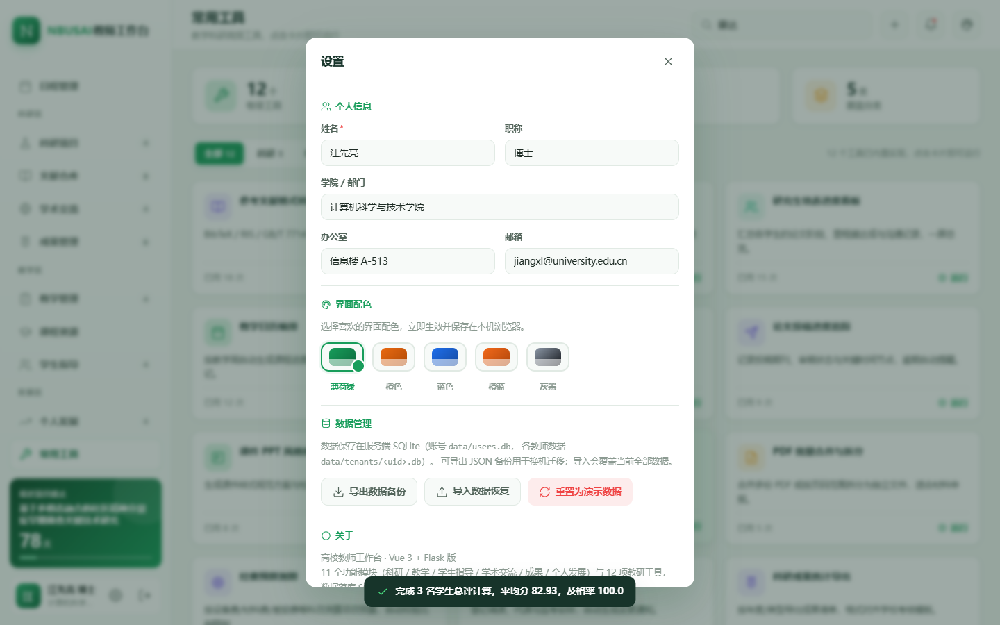

---

## 5. 运行测试

### 5.1 后端测试（308 例）

```bash
python -m pip install pytest
python -m pytest tests -q
```

覆盖：状态与统计接口、集合 CRUD、个人信息校验、全局搜索、导入导出与重置、
12 个工具的规格 / 参数校验 / 真实运行结果、上传下载与路径穿越防护、
工具留痕与频次统计、数据层（文档仓库、迁移、种子自洽性、日期与文件名工具函数）、
**认证与账号（登录 / 注册 / 会话 / 越权 / 租户隔离）**、
**管理端接口（总览统计 / 四类统计 / 账号增删改 / 自我保护校验）**、
**成果审核（队列汇总与自洽性 / 状态与教师筛选 / 关键词检索 / 通过 / 退回必填校验与字数上限 / 撤回 / 批量审核与容错 / 权限 401·403 / 教师侧登记与改动重新提交 / 存量数据回填）**、
**课程开放（可见性四态与时间窗口边界 / 开关与日期校验 / 资料上传下载删除 / 磁盘文件清理 / 跨租户路径防护 / 公开接口免登录准入与未开放拦截 / 私有字段不泄漏）**、
**课程助教与联系方式（日历清洗与自动补周次 / 助教名单白名单清洗与截断 / 补丁只改显式键 / QQ 群号清洗 / 二维码内容嗅探与替换 / 读取与公开下发 / 跨课程路径越权防护 / 未开放不下发二维码与助教）**、
**常用网站（URL 规范化与 SSRF 防护 / 图片类型嗅探 / 页面图标解析与优先级 / 两级缓存与失败标记 / 强制刷新 / 首字母头像与转义 / 站点信息接口 / 清单 CRUD 与搜索 / 存量库补种幂等）**、
**智能助手（知识库解析分块与 BM25 排序 / 超限与类型拦截 / LLM 配置掩码回显与掩码不覆盖 / 无 Key 连通测试与对话拦截 / mock 模型后的会话创建·历史带入·消息落库·删除清理 / 上传清单检索删除全流程 / 未登录 401）**、
**数据库连接的跨线程可用性（工作线程读写与提交 / 并发写序列化不丢数据 / 每线程独立连接 / close 后可复用 / 智能体工具在线程池中并发调用）**、
**对话失败回滚（新建空会话不留痕 / 已有会话只撤回本轮提问，便于重发且不产生重复历史）**。

```text
308 passed in ~165s
```

### 5.2 浏览器端到端验收（77 + 50 + 48 + 65 + 100 + 38 + 42 + 31 项）

需要本机装有 Playwright 的 Chromium（脚本会自动探测 `chromium-1243`）：

```bash
# 终端 1：启动服务
python run.py --port 5173 --prod

# 终端 2：跑验收
node tests/e2e_smoke.cjs http://127.0.0.1:5173        # 教师工作台 77 项
node tests/e2e_auth_admin.cjs http://127.0.0.1:5173   # 登录 / 注册 / 管理端 50 项
node tests/e2e_theme.cjs http://127.0.0.1:5173        # 配色主题 / 登录页 48 项
node tests/e2e_review.cjs http://127.0.0.1:5173       # 成果审核 / 教师详情页改版 65 项
node tests/e2e_courses.cjs http://127.0.0.1:5173      # 课程开放 / 助教 / 日历联系 / 学生公开页 100 项
node tests/e2e_links.cjs http://127.0.0.1:5173        # 常用网站独立页面 38 项
node tests/e2e_cv.cjs http://127.0.0.1:5173           # 个人简历发布 / 公开页 42 项
node tests/e2e_agent.cjs http://127.0.0.1:5173        # 智能助手页面 / 知识库 / 设置 31 项
```

验收内容：14 个页面全部渲染且导航高亮正确、4 类详情页进出、月历格子、
全局搜索弹窗与跳转、快捷新建菜单、真实运行「成绩批量计算」并断言计算结果、
设置面板回填、新建待办持久化（刷新后仍在）、浏览器控制台零报错；
登录页渲染、未登录 401 拦截、教师越权 403、管理端概览统计卡与横向对比表、
教师四类统计详情、新建 / 编辑 / 重置密码 / 停用 / 删除账号、注册独立空工作台；
**5 套配色逐套切换（主色断言、持久化、深色对比度、深色下逐页浏览）、
登录页统一外壳布局与卡片内配色选择、输入框图标与 46px 统一高度、密码显示 / 隐藏切换、主按钮文字居中**；
**成果审核队列（标签页计数自洽、行选与全选、详情弹窗字段与轨迹、单条通过 / 退回必填校验 / 撤回、批量通过、教师筛选与关键词检索、审核后计数回填并还原现场）、
教师统计详情页改版（渐变名片与 4 项核心指标、4 个区块锚点、16 张指标卡、环形图 / 条形图 / 仪表环渲染、审核概况跳转审核队列、深色主题适配）**；
**课程开放（资料上传 / 下载 / 删除与体积统计、开放设置弹窗实时预演与日期倒置拦截、关闭 / 定时 / 过期 / 恢复四种状态下学生页联动、学生匿名下载、公开接口私有字段不泄漏、深色与移动端适配）、
教学日历与联系方式（工作台日历标签页 14 周与合计学时、编辑弹窗回填 QQ 群号与二维码预览、从大纲两步确认生成 8 行、取消不落库；学生页日历 14 周并高亮本周、QQ 群号与二维码展示、二维码公开接口、手机号 tel: 链接、二维码放大 / 关闭）、
**课程助教（工作台助教标签页 2 位与身份徽标、电话 tel: / 邮箱 mailto: 链接、弹窗回填 2 条助教、添加一位并填满六项后保存落库、学生页同步展示 3 位与 tel: 链接去空格、首页信息条助教计数、删除还原 2 位；学生页助教卡含身份徽标 / 电话 / 邮箱 / 值班备注与联系提示）**；
**常用网站独立页面（12 张卡片与图标全部真实加载、分组分节标题与数量角标、关键词搜索命中、分组筛选、点击新标签打开对应站点、管理模式浮出编辑 / 删除与虚线新增卡、
添加网站自动抓取标题回填名称与图标状态、编辑回填与备注悬停提示、HTML5 拖动排序落库且刷新后保持、删除二次确认、深色主题与窄窗口自适应、结束后还原现场）**；
同时输出全套验收截图（70+ 张）到 `docs/screenshots/`。

```text
通过 77 / 77 项
通过 50 / 50 项
通过 48 / 48 项
通过 65 / 65 项
通过 100 / 100 项
通过 38 / 38 项
通过 31 / 31 项
```

---

## 6. HTTP 接口一览

| 方法 | 路径 | 说明 |
| --- | --- | --- |
| POST | `/api/auth/register` | 注册教师账号（可选演示数据初始化），免登录 |
| POST | `/api/auth/login` | 登录，写入签名 Cookie 会话，免登录 |
| POST | `/api/auth/logout` | 退出登录，免登录 |
| GET | `/api/auth/me` | 当前登录用户（未登录返回 401），免登录 |
| GET | `/api/admin/overview` | 全校汇总 + 教师横向对比（管理员） |
| GET | `/api/admin/teachers` | 教师列表（含简要统计，管理员） |
| GET | `/api/admin/teachers/<id>` | 单位教师四类统计详情（管理员） |
| POST | `/api/admin/teachers` | 新建教师 / 管理员账号（管理员） |
| PATCH | `/api/admin/teachers/<id>` | 编辑资料 / 停用启用（管理员） |
| POST | `/api/admin/teachers/<id>/password` | 重置密码（管理员） |
| DELETE | `/api/admin/teachers/<id>` | 删除账号及其租户库（管理员） |
| GET | `/api/admin/achievements` | 成果审核队列（`status` / `teacher` / `q` 过滤，含统计与教师下拉，管理员） |
| POST | `/api/admin/achievements/review` | 单条审核：`{teacherId, id, action: approve\|reject\|reset, note}`（管理员） |
| POST | `/api/admin/achievements/batch-review` | 批量审核：`{items: [{teacherId, id}], action, note}`（管理员） |
| GET | `/api/state` | 全量状态（15 集合 + 个人信息 + 派生统计），前端启动一次拉取 |
| GET | `/api/stats` | 分组统计（总览 / 成果 / 教学工作量 / 发展进度 / 工具分类） |
| GET·POST | `/api/collections/<coll>` | 列表 / 新建（`coll` ∈ 15 个集合） |
| PATCH·DELETE | `/api/collections/<coll>/<id>` | 局部更新 / 删除 |
| GET·PUT | `/api/profile` | 个人信息读取 / 更新 |
| GET | `/api/search?q=` | 全局搜索（13 个集合，单次最多 60 条） |
| GET | `/api/export` | 导出 JSON 备份 |
| POST | `/api/import` | 导入备份（覆盖当前数据） |
| POST | `/api/reset` | 重置为演示数据 |
| GET | `/api/tools/specs` | 12 个工具的字段规格（驱动前端渲染） |
| GET | `/api/tools/<key>/specs` | 单个工具的字段规格 |
| POST | `/api/tools/upload` | 上传文件（PDF / PPT），返回 `token/id` |
| POST | `/api/tools/<key>/run` | 运行工具，返回摘要 / 指标 / 文本 / 表格 / 下载链接 |
| GET | `/api/tools/download/<token>/<name>` | 下载运行产物（附件形式） |
| GET | `/api/courses/<id>/share` | 课程开放概况：访问令牌 / 可见性 / 资料计数（教师） |
| POST | `/api/courses/<id>/visibility` | 保存开放设置：`{published, openFrom, openUntil}`（教师） |
| POST | `/api/courses/<id>/materials` | 上传课程资料（multipart，单次 ≤10 个文件，教师） |
| GET | `/api/courses/<id>/materials/<mid>/download` | 教师端下载课程资料 |
| DELETE | `/api/courses/<id>/materials/<mid>` | 删除资料（服务器文件同步清理，教师） |
| GET·POST | `/api/courses/<id>/contact` | 读取 / 保存助教名单、QQ 群号与教学日历（服务端清洗，教师） |
| GET·PUT | `/api/agent/settings` | 读取（Key 掩码）/ 保存大模型配置（教师） |
| POST | `/api/agent/settings/test` | 大模型连通性测试（掩码 Key 原样传回时自动取真实 Key） |
| GET·POST·DELETE | `/api/agent/sessions[/<id>]` | 会话列表 / 新建 / 删除（连同消息） |
| GET | `/api/agent/sessions/<id>/messages` | 会话消息回读 |
| POST | `/api/agent/chat` | 发送消息（自动建会话，服务端清洗入库，返回回答与工具轨迹） |
| GET·POST | `/api/agent/kb` | 知识库文档清单 / 上传（multipart 多文件，≤10 MB） |
| DELETE | `/api/agent/kb/<docId>` | 删除文档（连同分块） |
| GET | `/api/agent/kb/search?q=` | 知识库 BM25 检索试测（返回命中片段与相关度） |
| GET·POST·DELETE | `/api/courses/<id>/qr` | 群二维码：读取（教师）/ 上传（≤4 MB，内容嗅探）/ 移除 |
| GET | `/api/cv` | 简历发布概况：固定链接 / 公开开关 / 区块开关与各区块条目数（教师） |
| POST | `/api/cv/visibility` | 公开开关：`{published}`（教师） |
| POST | `/api/cv/sections` | 区块显示开关：只接受 11 个已知区块键（教师） |
| POST | `/api/cv/token` | 更换固定链接，旧链接立即失效（教师） |
| POST·DELETE·GET | `/api/cv/avatar` | 头像上传（≤4 MB 按内容嗅探）/ 删除 / 读取（教师） |
| GET | `/api/cv/preview` | 聚合后的简历数据（与公开页同源，教师预览） |
| GET | `/api/public/cv/<token>` | **免登录** 获取公开简历（未公开返回 403，不下发正文） |
| GET | `/api/public/cv/<token>/avatar` | **免登录** 读取简历头像（校验路径归属，防越权） |
| GET | `/cv/<token>` | 个人简历公开页（HTML 入口，免登录） |
| GET | `/api/public/courses/<token>` | **免登录** 学生获取课程公开数据（未开放返回 403 + 原因） |
| GET | `/api/links/favicon?url=&name=&t=` | 站点图标（服务端抓取 + 缓存，抓不到返回首字母头像，永不 404，教师） |
| GET | `/api/links/meta?url=` | 站点标题 / 主机名 / 图标地址，供「添加网站」自动填充（教师） |
| GET | `/api/public/courses/<token>/materials/<mid>/download` | **免登录** 学生下载课程资料（二次校验可见性） |
| GET | `/api/public/courses/<token>/qr` | **免登录** 课程群二维码（未开放返回 403） |
| GET | `/c/<token>` | 学生公开课程页（HTML 入口，免登录） |

---

## 7. 常见问题

- **端口被占用**：`python run.py --port 8001` 换个端口即可。
- **局域网同事访问**：用 `--host 0.0.0.0 --prod` 启动，防火墙放行端口后访问 `http://<你的IP>:<端口>`。
- **彻底离线运行**：前端只有 `vendor/vue.global.prod.js` 一个外部资源且已本地化，断网也能正常使用（PDF 工具依赖本机 pypdf）。
- **数据文件变大**：`data/tmp/` 与 `data/uploads/` 里的过期目录会在每次启动时自动清理（保留 2 天）。
- **想清空重来（含账号）**：停止服务后删除 `data/users.db`、`data/secret.key` 与 `data/tenants/`，重启即重建全部演示账号。
- **想清空重来（仅当前教师数据）**：设置面板 → 重置为演示数据。
- **环境变量覆盖数据目录**：`FWB_DATA_DIR`（数据根目录）、`FWB_USERS_DB_PATH`（账号库路径）。

---

## 8. 二次开发指引

- **改主题色**：直接改 `frontend/css/style.css` 里 `:root` 的品牌主色变量（`--primary` 系列）；或参考文件末尾的 `[data-theme="…"]` 块新增一套配色，并在 `frontend/js/theme.js` 的 `THEMES` 里登记即可全站生效。
- **加一个页面**：在 `frontend/js/pages/` 新建组件并注册到 `FWB.pages`，再在 `js/app.js` 的 `NAV_GROUPS` 与 `js/util.js` 的 `PAGE_META / NAV_PARENT` 各加一行。
- **加一个集合**：`backend/config.py` 的 `COLLECTIONS` 加名字 → `backend/seed.py` 加种子 → 前端 `js/store.js` 的 `data` 加数组即可。
- **加一个工具**：在 `backend/tools.py` 写实现并注册到 `TOOL_IMPLS`，在 `backend/tool_specs.py` 写字段规格，再在 `backend/seed.py` 的 `TOOLS` 里加一条 `{name, category, desc, url}` —— 前端零改动。
